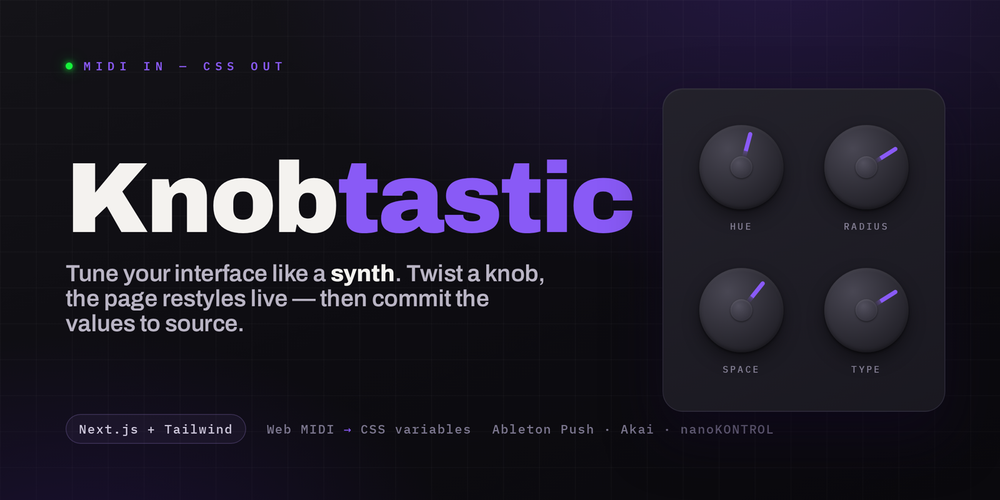
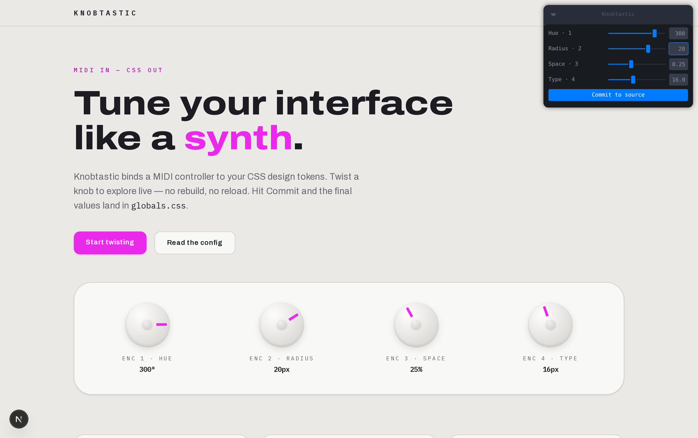

<div align="center">



<br />

**Bind a physical MIDI controller to the CSS design tokens of a running Next.js + Tailwind site.**
<br />
Twist a knob, the page restyles live with zero recompile — hit **Commit** and the values land in `globals.css`.

<br />

[](LICENSE)
[](https://github.com/pixist/knobtastic/releases)
[](https://nextjs.org)
[](https://tailwindcss.com)


[Install](#install) · [Run the demo](#run-the-demo) · [How it works](#how-it-works) · [Config](#config) · [Controllers](#controllers) · [Claude skill](#claude-skill)

</div>

---

Picking colors, radii, and spacing by editing numbers, saving, and squinting at the reload is a slow feedback loop. Knobtastic closes it: your design tokens become knobs on the hardware already on your desk. You tune with your hands while watching the real page, and only the final values ever touch source.

<div align="center">

</div>

### The hero interaction

1. Open your running Next.js + Tailwind site in Chrome.
2. A control panel lists the tweakable design tokens.
3. Twist a knob → the matching variable updates **live on the page, zero recompile**.
4. Happy? Hit **Commit** → the values are written into source and the panel detaches.

---

## Install

Install the Claude Code skill with one line:

```sh
sh -c "$(curl -fsSL https://raw.githubusercontent.com/pixist/knobtastic/main/install.sh)"
```

It drops the skill into `~/.claude/skills` (override with `CLAUDE_SKILLS_DIR`). From then on, in any Next.js + Tailwind project, Claude Code offers the knob-tuning step before committing UI work — or you invoke it directly with `/knobtastic`. Manual install options are in the [Claude skill](#claude-skill) section.

## Run the demo

```sh
pnpm install
pnpm dev
# open http://localhost:3000 in Chrome (or Edge — Web MIDI required)
# plug in a MIDI controller, allow MIDI access, twist the knobs
# happy? click "Commit to source" — check the diff in src/app/globals.css
```

No manual mapping needed for known controllers: the panel detects the device by its MIDI port name and assigns its encoders to the knobs in `knobs.config.ts` **declaration order** — the first declared token lands on the first physical knob. Hot-plug works; the resolved mapping prints to the browser console.

## How it works

Two phases, kept strictly separate.

| Phase | What happens | Touches source? |
|---|---|---|
| **Live** | Knob turns arrive as MIDI control-change messages via the native Web MIDI API, get normalized into each token's range, and are applied as inline CSS custom properties on `<html>`. | No — runtime state only, nothing recompiles. |
| **Commit** | One click POSTs the current values to a dev-only route that rewrites the token block in `globals.css`; the panel clears its overrides and detaches. | Yes — exactly once, one clean diff. |

The Leva panel drives the exact same code path as the hardware, so you can tune with on-screen sliders alone if no controller is plugged in.

## Config

Bindings are declared explicitly in **`knobs.config.ts`** (v0 has no auto-inference):

```ts
export const knobs: KnobDef[] = [
  {
    id: "radius",         // panel key + commit payload key
    label: "Radius",      // shown in panel and faceplate
    cssVar: "--radius-n", // unitless CSS custom property to drive
    min: 0,
    max: 28,
    step: 1,
    cc: 72,               // optional — omit to auto-assign from detected device
    mode: "relative",     // optional — omit to follow the device profile
    relScale: 0.5,        // relative only: value change per tick = step * relScale
    unitLabel: "px",      // display only
    // readoutScale: 100  // display only, multiplies faceplate readout
  },
];
```

Tokens are **unitless numbers**; `globals.css` derives the united values below a marker-fenced block:

```css
/* knobtastic:tokens:start — this block is rewritten by Knobtastic Commit */
:root {
  --primary-h: 258;
  --radius-n: 10;
  --space-n: 0.25;
  --fs-n: 16;
}
/* knobtastic:tokens:end */

:root {
  --primary: hsl(var(--primary-h) 82% 54%);
  --radius: calc(var(--radius-n) * 1px);
}
```

Commit only ever rewrites values **between the two marker comments**, validated against the config — unknown variables are rejected and values are clamped to `min`/`max`.

<details>
<summary><b>Demo token map</b></summary>

<br />

| Knob   | CC | Token         | Drives                                              |
|--------|----|---------------|-----------------------------------------------------|
| Hue    | 71 | `--primary-h` | Hue of the primary color                            |
| Radius | 72 | `--radius-n`  | Border-radius scale (buttons, cards)                |
| Space  | 73 | `--space-n`   | Tailwind's `--spacing` base — the whole page rhythm |
| Type   | 74 | `--fs-n`      | Root font-size — every rem-based size               |

</details>

## Controllers

Detection matches the connected device against profiles in `src/knobs/devices.ts`:

| Controller | Encoders | Mode |
|---|---|---|
| Ableton Push 1/2 (User Mode) | CC 71–78 | relative |
| Akai MPK Mini | CC 70–77 | absolute |
| Korg nanoKONTROL2 | CC 16–23 | absolute |

- **`mode: "relative"`** — endless encoders sending two's-complement ticks. Each tick moves the value by `step * relScale`. On a Push, hold the **User** button first.
- **`mode: "absolute"`** — 0–127 pots; the physical range maps onto `[min, max]`.

Unknown controller? Set `cc`/`mode` explicitly per knob, or add a profile (name regex + encoder list) to `devices.ts`.

## Claude skill

`skill/knobtastic/` is an exportable Claude Code skill (packaged as [`dist/knobtastic.skill`](dist/knobtastic.skill)). Once installed, Claude offers the knob-tuning step when finishing UI work: it wires the design tokens it's least sure about into a Knobtastic panel, detects your controller (`amidi -l` / device profiles), starts the dev server, hands you the knobs, waits for your **Commit** click, and folds the tuned values into the pending git commit.

Invoke it directly with natural-language arguments:

```
/knobtastic                                   full tune-before-commit flow
/knobtastic tie the card shadow depth to a knob
/knobtastic bind the hero gradient hue to knob 2
/knobtastic use my nanoKONTROL
```

Install with the one-liner above, or by hand from a checkout:

```sh
./install.sh                      # copies skill/knobtastic → ~/.claude/skills
cp -r skill/knobtastic ~/.claude/skills/   # or manually
```

The packaged `dist/knobtastic.skill` can also be dropped straight into Claude for a single-file install.

## Limitations

- Chrome/Edge only — Web MIDI is not implemented in Firefox or Safari.
- Commit runs only on the dev server (`NODE_ENV=development`).
- Bindings are declared by hand; AI-assisted inference is a later milestone.

## Scripts

```sh
pnpm dev     # run the demo
pnpm test    # unit tests for the MIDI decode + commit rewriter
pnpm lint
pnpm build
```

## License

[Apache-2.0](LICENSE) © [pixist](https://github.com/pixist)
